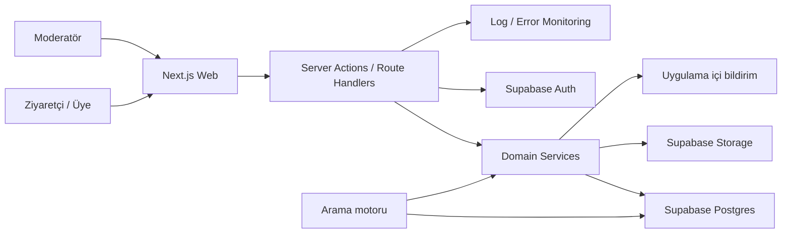

# 02 — Teknik Mimari

## 1. Mimari hedef

Yeni başlayanların anlayabildiği, 9 kişinin paralel çalışabildiği, güvenli sınırları net, tek container ile taşınabilir bir web uygulaması.

Mimari şu dört ihtiyacı birlikte karşılar:

- public ve indekslenebilir vaka sayfaları;
- authenticated yazma akışları;
- PostgreSQL tabanlı açıklanabilir arama;
- podların az dosya çakışmasıyla dikey dilim geliştirmesi.

## 2. Teknoloji tabanı

| Katman | Seçim | Neden |
|---|---|---|
| Web | Next.js App Router, React, TypeScript strict | Tek dil, SSR/public sayfa, route ve server sınırı |
| Stil | Tailwind CSS + erişilebilir primitive/component katmanı | Hızlı üretim, ortak token, tutarlı durumlar |
| Veri | Supabase Postgres | Yönetilen Postgres, migration ve açık kaynak uyumu |
| Kimlik | Supabase Auth | Google OAuth + email OTP; oturum yönetimi |
| Dosya | Supabase Storage | Kontrollü obje depolama |
| Şema doğrulama | Zod veya eşdeğer runtime schema | İstemci ve sunucu sınırlarında açık doğrulama |
| Test | Unit + integration + Playwright E2E | Domain kuralları ve ana kullanıcı akışları |
| Dağıtım | Next.js standalone Docker | Vercel'e kilitlenmeden Railway/Render/Fly/VPS |
| Gözlem | Structured logs + error monitoring adapter | Request ID, hata takibi, PII redaksiyonu |

Kesin framework sürümleri repo iskeleti kurulurken güncel stabil sürümlerden kilitlenir. Bu belge semver numarası uydurmaz; lockfile kaynak kabul edilir.

## 3. Sistem görünümü



`C` ayrı servis değildir. v0.1'de uygulamanın domain katmanındaki PostgreSQL sorgu modülüdür.

## 4. Güven sınırı

Tarayıcı, privileged DB anahtarı veya storage service role görmez. Mutasyonların canonical yolu:

```text
request
→ auth/session
→ rate limit
→ schema validation
→ ownership/role check
→ domain service
→ DB transaction
→ audit/notification
→ sanitized response
```

Public okumalar cache'lenebilir. Yazma, moderasyon, merge, solve ve upload işlemleri server sınırından geçer. RLS ikinci savunma katmanıdır; uygulama yetki kontrolünün yerine kullanılmaz.

## 5. Önerilen repo yapısı

```text
app/
  [locale]/
    (public)/
      page.tsx
      search/page.tsx
      cases/[slug]/page.tsx
      profiles/[handle]/page.tsx
    (auth)/
      login/page.tsx
      verify/page.tsx
    (member)/
      cases/new/page.tsx
      me/page.tsx
      notifications/page.tsx
    (moderator)/
      moderation/page.tsx
  api/
    health/route.ts
    search/route.ts
    cases/...
    uploads/...
components/
  shared/
  search/
  case-create/
  case-detail/
  evidence/
  profile/
  moderation/
features/
  discovery/
  case-workspace/
  trust/
server/
  auth/
  db/
  domain/
    cases/
    evidence/
    moderation/
    notifications/
    search/
  storage/
  observability/
lib/
  schemas/
  i18n/
  errors/
  constants/
supabase/
  migrations/
  seed.sql
tests/
  unit/
  integration/
  e2e/
docs/
  decisions/
  glossary.md
```

Podlar `features/` ve ilgili `components/` alanlarının sahibidir. `server/auth`, `server/db`, `supabase/migrations`, `lib/errors` ve ortak kontratlar Bora'nın entegrasyon alanıdır. Pod ihtiyaç açabilir; tek başına değiştiremez.

## 6. Katman sorumlulukları

### UI

- form state ve kullanıcı geri bildirimi;
- loading, empty, error ve success durumları;
- erişilebilir etiket, focus ve klavye akışı;
- server'dan gelen güvenli view model'i gösterme;
- role veya güvenlik kararı vermeme.

### Transport

- request parse etme;
- auth ve rate-limit bağlamı kurma;
- input/output şemasını doğrulama;
- domain hatasını stabil HTTP/error koduna çevirme;
- PII veya stack trace sızdırmama.

### Domain

- vaka/kanıt durum geçişleri;
- ownership ve moderator yetkisi;
- duplicate merge ve solve kuralları;
- transaction sınırları;
- audit event ve notification üretimi.

### Persistence

- parametreli sorgular;
- transaction ve constraintler;
- arama indexleri;
- soft delete ve görünürlük filtreleri;
- migrationların ileri/geri işletim notları.

## 7. Auth tasarımı

### Üye

- Google OAuth: Authorization Code + PKCE; kesin redirect allowlist.
- E-posta: tek kullanımlık doğrulama kodu; hedef geçerlilik 10 dakika.
- Kod tekrar kullanılamaz; başarısız denemeler ve gönderim rate-limitlidir.
- Session cookie `HttpOnly`, `Secure`, uygun `SameSite`; girişte ve yetki yükselmesinde oturum döndürülür.
- Public kimlik e-posta değil, benzersiz nickname/handle'dır.

### Moderatör/admin

- MFA veya passkey zorunlu.
- Ayrı role claim'i yalnız server tarafında okunur.
- Kritik eylemler yeniden doğrulama isteyebilir.
- Her moderasyon eylemi değiştirilemez audit olayına yazılır.

### Yetki ilkesi

```ts
authorize(action, actor, resource): Allow | Deny
```

UI'da butonu gizlemek yetki değildir. Domain service her işlemde yetkiyi tekrar kontrol eder.

## 8. Arama mimarisi

### v0.1 stratejisi

- `search_document`: başlık, hatırlanan ayrıntı, önceki aramalar ve çözüm adından oluşturulan `tsvector`.
- GIN index: full-text sorgu.
- `pg_trgm`: normalize başlık ve hatırlanan ifade benzerliği.
- Filtre indexleri: visibility/status, media_type, content_language, year range, country/platform.
- Karışık TR/EN içerik için başlangıçta `simple` text search config + normalize edilmiş alanlar. Dil özel config ancak migration ortamında doğrulanırsa eklenir.

### Örnek puanlama

```text
score =
  0.45 * full_text_rank
+ 0.25 * title_trigram_similarity
+ 0.15 * remembered_phrase_similarity
+ 0.10 * metadata_overlap
+ 0.05 * verified_solution_signal
```

Katsayılar ürün gerçeği değil, başlangıç hipotezidir. Sabit test vakaları ve gerçek aramalarla ayarlanır. Sonuç sırası aynı girdide deterministik tie-breaker (`updated_at`, `id`) kullanır.

### Performans

- Varsayılan limit 20, cursor pagination.
- Çok kısa sorgu veya limitsiz wildcard reddedilir.
- Query timeout uygulanır.
- `EXPLAIN ANALYZE` kanıtı olmadan index eklenmez.
- 10.000 vaka sentetik performans datasıyla p95 < 1 saniye hedefi ölçülür.

## 9. Dosya yükleme mimarisi

### Kabul edilen

- JPG, PNG, WebP
- En çok 5 MB
- Bir kanıt kartında sınırlı sayıda görsel; v0.1 hedefi 1

### Akış

1. Üye upload niyeti oluşturur.
2. Server auth, rate-limit, case erişimi ve metadata doğrular.
3. Rastgele object key ve kısa ömürlü upload izni üretir.
4. Yükleme sonrası server dosya imzası/MIME, boyut ve çözünürlük sınırını kontrol eder.
5. Görsel decode/re-encode edilir; EXIF temizlenir.
6. Geçerliyse attachment kaydı bağlanır; değilse obje karantinadan silinir.
7. Public okuma `/media/evidence/:id` benzeri kontrollü proxy veya kısa ömürlü URL üzerinden yapılır.

Sunucu v0.1'de kullanıcı URL'sini fetch etmez. Bu karar SSRF, zararlı içerik indirme ve preview karmaşasını azaltır.

## 10. i18n

- Route locale: `tr` ve `en`.
- System copy key tabanlıdır; bileşen içinde iki dilli hardcode yapılmaz.
- Enum değerleri DB'de İngilizce sabit kod; UI'da çevrilmiş label.
- Kullanıcı içeriği özgün dilde kalır.
- URL slug'ı vaka başlığından üretilir fakat vaka ID'siyle benzersizleştirilir.

## 11. Cache ve yeniden doğrulama

| İçerik | Strateji |
|---|---|
| Public vaka | Kısa cache + değişiklikte tag invalidation |
| Arama | Varsayılan no-store veya çok kısa cache; sorgu PII riski nedeniyle log/cache anahtarına dikkat |
| Taslak/profil özel görünüm | No-store |
| Static legal/about | Uzun cache |
| Görsel proxy | İçeriğin visibility durumuna bağlı cache; silmede purge |

Bir merge veya soft delete sonrası eski public içerik cache'ten temizlenir. Birden çok replica olduğunda Next.js cache koordinasyonu test edilmeden in-memory varsayımına güvenilmez.

## 12. Hata modeli

```ts
type ErrorResponse = {
  error: {
    code: string;
    message: string;
    fieldErrors?: Record<string, string[]>;
    requestId: string;
  };
};
```

Kullanıcı mesajı eyleme dönüktür. Internal exception, SQL, stack trace, provider yanıtı veya e-posta loglanmaz/gösterilmez.

Örnek kodlar:

- `AUTH_REQUIRED`
- `FORBIDDEN`
- `VALIDATION_FAILED`
- `CASE_NOT_FOUND`
- `INVALID_STATUS_TRANSITION`
- `DUPLICATE_SUBMISSION`
- `RATE_LIMITED`
- `UPLOAD_REJECTED`
- `CONFLICT`

## 13. Gözlemlenebilirlik

### Structured log alanları

- timestamp
- level
- event
- request_id
- route/action
- actor_id_hash veya anonim
- resource_id
- duration_ms
- outcome/error_code

Arama metni, e-posta, OTP, session, token, tam IP veya yüklenen dosya içeriği loglanmaz. Gerekli güvenlik olaylarında IP yalnız kısaltılmış/hash'lenmiş ve süreli tutulur.

### Ürün eventleri

- `search_submitted`
- `search_result_opened`
- `case_creation_started`
- `case_published`
- `evidence_added`
- `evidence_status_changed`
- `case_solved`
- `content_reported`

Eventler minimum özellik taşır; serbest metin kullanıcı içeriği analytics'e gönderilmez.

## 14. Dağıtım

### Container kontratı

- Multi-stage Docker build
- Next.js `output: "standalone"`
- Non-root runtime user
- Read-only filesystem mümkünse aktif
- `PORT` ve `HOSTNAME` üzerinden çalışır
- `/api/health/live` process durumunu, `/api/health/ready` gerekli bağımlılıkları kontrol eder
- Startup migration otomatik koşmaz; release job ayrı çalışır
- SIGTERM graceful shutdown

### Ortamlar

```text
local → preview/test → production
```

Her ortamın ayrı Supabase projesi/DB'si ve OAuth redirect allowlist'i olur. Preview ortamı production verisi kullanmaz.

### Gerekli env adları

Değerler bu belgede veya repoda tutulmaz.

```text
APP_BASE_URL
NEXT_PUBLIC_SUPABASE_URL
NEXT_PUBLIC_SUPABASE_ANON_KEY
SUPABASE_SERVICE_ROLE_KEY
DATABASE_URL
AUTH_EMAIL_FROM
ERROR_MONITORING_DSN
RATE_LIMIT_STORE_URL
RATE_LIMIT_STORE_TOKEN
```

`NEXT_PUBLIC_` yalnız gerçekten public anahtarlar içindir. Service role ve DB URL istemci bundle'ına giremez. E-posta teslim sağlayıcısı Supabase production SMTP ayarına dış ortamda bağlanır; credential yoksa release blocker olarak raporlanır.

## 15. Mimari karar kaydı gereken değişiklikler

- Yeni dış servis veya dependency
- Şema/enum değişikliği
- Auth sağlayıcısı veya session stratejisi
- Public/private veri sınırı
- Dosya türü veya boyut limiti
- Kullanıcı URL'sini sunucudan fetch etme
- AI/embedding/scraping ekleme
- Deployment provider'a özel servis kullanma
- Lisans veya katkı modelini değiştirme

## 16. Tasarım ilkesi: dikey pod, ortak çekirdek

Her pod kullanıcıya çalışan bir akış teslim eder; “yalnız frontend” veya “yalnız backend” podu yoktur. Ortak DB/auth/storage çekirdeği entegrasyon alanında tutulur. Böylece yeni başlayan kişi kendi özelliğinin ekranını, doğrulamasını, server işlemini ve testini birlikte görür; dokuz kişi aynı şema dosyasını düzenlemez.
