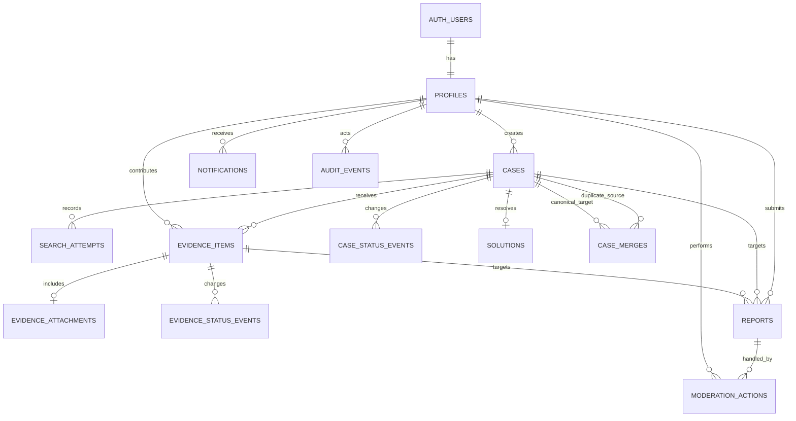

# 03 — Veri Modeli

## 1. Modelleme ilkeleri

- Veritabanı iş kurallarını constraintlerle destekler; tek savunma UI değildir.
- Kullanıcı içeriği, kimlik bilgisi ve operasyon kayıtları ayrı tutulur.
- Public görünürlük açık bir alanla belirlenir; “satır varsa public” varsayımı yapılmaz.
- Ana ilişkiler normalize edilir; medya türüne özel değişken alanlar sürümlü JSONB olarak saklanır.
- EAV (“alan adı/değer” tablosu) kullanılmaz.
- Silme varsayılanı soft delete; güvenlik ve yasal talep durumları ayrı prosedürdür.
- Her migration ileri değişiklik, veri etkisi, rollback ve doğrulama sorgusu içerir.

## 2. ER diyagramı



## 3. Enumlar

DB değerleri kodda değişmeyen İngilizce sabitlerdir. TR/EN karşılık UI sözlüğündedir.

```ts
type CaseStatus =
  | "OPEN"
  | "RESEARCHING"
  | "STRONG_CANDIDATE"
  | "SOLVED"
  | "MERGED";

type CaseVisibility = "DRAFT" | "PUBLIC" | "HIDDEN";

type EvidenceStatus = "NEW" | "POSSIBLE" | "REJECTED" | "VERIFIED";

type MediaType =
  | "VIDEO"
  | "AUDIO"
  | "IMAGE"
  | "GAME"
  | "WEBSITE"
  | "ADVERTISEMENT"
  | "FILM_TV"
  | "PRINT"
  | "OTHER";

type UserRole = "MEMBER" | "MODERATOR" | "ADMIN";

type ReportReason =
  | "PERSONAL_DATA"
  | "HARASSMENT_DOXXING"
  | "SPAM"
  | "COPYRIGHT"
  | "HARMFUL_CONTENT"
  | "WRONG_CATEGORY"
  | "OTHER";
```

`MERGED` public araştırma akışında gösterilen durum değildir. Kayıt geçmişi ve redirect için tutulur.

## 4. Tablolar

### 4.1 `profiles`

Supabase `auth.users` kaydının public ürün profilidir.

| Alan | Tip | Kural |
|---|---|---|
| `id` | uuid PK/FK | `auth.users.id` |
| `handle` | text unique | 3–30, normalize lowercase; reserved list |
| `display_name` | text | 1–60 |
| `role` | enum | Default `MEMBER`; istemciden değiştirilemez |
| `locale` | text | `tr` veya `en` |
| `bio` | text nullable | En çok 280; public |
| `avatar_path` | text nullable | Kontrollü obje yolu |
| `status` | text | active/suspended/deleted |
| `created_at` | timestamptz | Server default |
| `updated_at` | timestamptz | Trigger veya uygulama |
| `deleted_at` | timestamptz nullable | Pseudonymization işareti |

E-posta `profiles` tablosunda public alan olarak kopyalanmaz.

### 4.2 `cases`

| Alan | Tip | Kural |
|---|---|---|
| `id` | uuid PK | Server üretir |
| `owner_id` | uuid FK | `profiles.id` |
| `slug` | text unique | PII redaksiyon kontrolünden sonra |
| `title` | text | 12–120 |
| `media_type` | enum | Zorunlu |
| `content_language` | text | ISO dil etiketi |
| `country_region` | text nullable | Normalize edilmiş serbest değer |
| `seen_on` | text | 2–200 |
| `year_from` | smallint nullable | Mantıklı aralık |
| `year_to` | smallint nullable | `year_to >= year_from` |
| `year_unknown` | boolean | Yıl bilinmiyor seçimi |
| `remembered_details` | text | 80–5.000 |
| `remembered_quote` | text nullable | En çok 1.000 |
| `previous_searches` | text | “Yok” dahil, en çok 2.000 |
| `media_specific_details` | jsonb | App şemasıyla doğrulanır |
| `form_schema_version` | integer | Başlangıç 1 |
| `status` | enum | Default `OPEN` |
| `visibility` | enum | Default `DRAFT` |
| `canonical_case_id` | uuid nullable FK | Merge sonrası ana vaka |
| `published_at` | timestamptz nullable | Public olduğunda |
| `solved_at` | timestamptz nullable | Çözümle atomik |
| `created_at` | timestamptz | Server default |
| `updated_at` | timestamptz | Server/trigger |
| `deleted_at` | timestamptz nullable | Soft delete |

Constraintler:

- `year_unknown = true` ise yıl alanları boş olabilir; false ise en az biri gerekir.
- `visibility = PUBLIC` için yayın zorunlu alanları dolu olmalıdır.
- `status = MERGED` ise `canonical_case_id` zorunludur ve kendisine işaret edemez.
- `status = SOLVED` ise aktif `solutions` kaydı bulunmalıdır; bu bütünlük transaction/domain katmanında da korunur.

### 4.3 `search_attempts`

Vaka sahibinin daha önce denediği adayları yapılandırır; yinelenen öneriyi önler.

| Alan | Tip | Kural |
|---|---|---|
| `id` | uuid PK |  |
| `case_id` | uuid FK | Cascade değil; vaka yaşam döngüsüne bağlı |
| `query_or_candidate` | text | 2–500 |
| `result_summary` | text nullable | Ne bulundu/niçin değil |
| `source_url` | text nullable | HTTPS/HTTP allowlist şeması |
| `created_by` | uuid FK |  |
| `created_at` | timestamptz |  |

### 4.4 `evidence_items`

| Alan | Tip | Kural |
|---|---|---|
| `id` | uuid PK |  |
| `case_id` | uuid FK | Public case |
| `author_id` | uuid FK | Aktif üye |
| `claim` | text | 10–500 |
| `source_url` | text | HTTP/HTTPS; server fetch etmez |
| `rationale` | text | 30–2.000 |
| `status` | enum | Default `NEW` |
| `status_reason` | text nullable | `REJECTED` için zorunlu |
| `reviewed_by` | uuid nullable FK | Owner veya moderator |
| `reviewed_at` | timestamptz nullable |  |
| `created_at` | timestamptz |  |
| `updated_at` | timestamptz |  |
| `deleted_at` | timestamptz nullable | Soft delete |

Bir URL bir vakada tekrar kullanılabilir; farklı gerekçe olabilir. Aynı aktörün aynı vaka+normalize URL+claim kombinasyonunu kısa sürede tekrar göndermesi idempotency ve unique fingerprint ile engellenir.

### 4.5 `evidence_attachments`

| Alan | Tip | Kural |
|---|---|---|
| `id` | uuid PK |  |
| `evidence_id` | uuid unique FK | v0.1 bir kanıt = en çok bir görsel |
| `storage_key` | text unique | Tahmin edilemez key |
| `media_type` | text | image/jpeg, image/png, image/webp |
| `byte_size` | integer | ≤ 5 MB |
| `width` / `height` | integer | Decode edilmiş gerçek değer |
| `sha256` | text | Bütünlük ve duplicate kontrol |
| `processing_status` | text | pending/accepted/rejected |
| `rights_confirmed_at` | timestamptz | Zorunlu |
| `created_at` | timestamptz |  |
| `deleted_at` | timestamptz nullable |  |

Ham client MIME'ı güven kaynağı değildir.

### 4.6 Durum olayları

`case_status_events` ve `evidence_status_events` benzer yapıya sahiptir:

- entity ID
- `from_status`
- `to_status`
- `actor_id`
- `reason`
- `created_at`
- `request_id`

Olay kaydı ana değişiklikle aynı transaction içinde yazılır.

### 4.7 `solutions`

| Alan | Tip | Kural |
|---|---|---|
| `id` | uuid PK |  |
| `case_id` | uuid unique FK | Bir aktif çözüm |
| `evidence_id` | uuid nullable FK | Tercihen doğrulanmış kanıt |
| `canonical_name` | text | 2–300 |
| `source_url` | text | Zorunlu |
| `explanation` | text | 30–2.000 |
| `confirmed_by` | uuid FK | Owner veya moderator |
| `created_at` | timestamptz |  |
| `revoked_at` | timestamptz nullable | Çözüm geri alındığında |
| `revoke_reason` | text nullable |  |

Çözüm kaydı, case status ve event aynı transaction içinde üretilir.

### 4.8 `case_merges`

| Alan | Tip | Kural |
|---|---|---|
| `id` | uuid PK |  |
| `source_case_id` | uuid FK | Birleştirilen vaka |
| `canonical_case_id` | uuid FK | Eski/ana vaka |
| `merged_by` | uuid FK | Moderator |
| `reason` | text | Zorunlu |
| `merge_snapshot` | jsonb | Taşınan/korunan kayıt özeti |
| `created_at` | timestamptz |  |

Merge sırasında:

- en eski uygun vaka canonical seçilir;
- source kayıt `MERGED` olur;
- evidence ve araştırma denemeleri canonical vakaya taşınır veya kaynak kimliğiyle bağlanır;
- katkı sahipliği korunur;
- eski slug canonical URL'ye 308 yönlenir;
- geri alma için snapshot ve audit tutulur.

### 4.9 `reports`

| Alan | Tip | Kural |
|---|---|---|
| `id` | uuid PK |  |
| `reporter_id` | uuid FK | Auth zorunlu |
| `case_id` | uuid nullable FK | Hedeflerden biri |
| `evidence_id` | uuid nullable FK | Hedeflerden biri |
| `reason` | enum |  |
| `details` | text | 10–1.000 |
| `status` | text | open/in_review/resolved/dismissed |
| `priority` | text | PII/doxxing otomatik yüksek |
| `assigned_to` | uuid nullable FK | Moderator |
| `created_at` | timestamptz |  |
| `resolved_at` | timestamptz nullable |  |

Tam bir hedef zorunludur; hem hedef yok hem iki hedef birden olamaz.

### 4.10 `moderation_actions`

- report ID (varsa)
- actor moderator ID
- action type
- target type/ID
- reason
- before/after redakte snapshot
- request ID
- created at

### 4.11 `notifications`

| Alan | Tip | Kural |
|---|---|---|
| `id` | uuid PK |  |
| `recipient_id` | uuid FK |  |
| `type` | text | Sabit allowlist |
| `actor_id` | uuid nullable FK |  |
| `case_id` | uuid nullable FK |  |
| `evidence_id` | uuid nullable FK |  |
| `payload` | jsonb | Serbest kullanıcı metni içermez |
| `read_at` | timestamptz nullable |  |
| `created_at` | timestamptz |  |

Bildirim oluşturma idempotent fingerprint kullanır; aynı olay tekrarında bildirim çoğalmaz.

### 4.12 `audit_events`

Güvenlik ve yönetim olayları için append-only kayıt:

- actor ID veya system
- event type
- resource type/ID
- request ID
- outcome
- redakte metadata
- timestamp

OTP, token, tam kullanıcı içeriği, dosya bytes veya hassas provider yanıtı audit'e girmez.

## 5. Arama alanları ve indexler

### Normalize alanlar

- `normalized_title`
- `normalized_remembered_quote`
- `search_document`

Normalize işleminde Unicode normalizasyonu, kontrollü lowercase ve gerekirse `unaccent` kullanılır. Özgün içerik ayrıca korunur.

### Başlangıç indexleri

| Index | Amaç |
|---|---|
| GIN `search_document` | Full-text arama |
| GIN/GiST trigram `normalized_title` | Yazım ve başlık benzerliği |
| Trigram `normalized_remembered_quote` | Hatırlanan cümle benzerliği |
| `(visibility, status, published_at desc)` | Public liste |
| `(media_type, content_language)` | Filtre |
| `(year_from, year_to)` | Dönem filtresi |
| `(owner_id, created_at desc)` | Profil ve taslak |
| `(case_id, status, created_at desc)` | Kanıt listesi |
| `(recipient_id, read_at, created_at desc)` | Bildirim |
| `(status, priority, created_at)` | Moderasyon kuyruğu |

Index listesi başlangıç tasarımıdır. Gerçek query planı ve `EXPLAIN ANALYZE` ile doğrulanır; yazma maliyeti ölçülmeden gereksiz index tutulmaz.

## 6. RLS ve erişim politikası özeti

RLS defense-in-depth olarak aktiftir.

- Public: yalnız `visibility=PUBLIC`, `deleted_at IS NULL`, `status<>MERGED` okunur.
- Owner: kendi taslağını okuyup düzenleyebilir.
- Member: public vakaya kanıt ekleyebilir; yalnız kendi kanıt içeriğini sınırlı kuralla düzenleyebilir.
- Moderator: server doğrulanmış role ile operasyon yapar.
- Service role yalnız server runtime'da bulunur.
- Audit ve moderation tabloları istemciden doğrudan okunmaz.

Policy testleri her rol için olumlu ve olumsuz senaryo içerir.

## 7. Silme ve saklama

Başlangıç politikası:

- Yayınlanmamış taslak: sahibi silebilir; kısa geri alma penceresinden sonra fiziksel silinir.
- Public vaka: katkılar varsa soft delete/tombstone; moderator prosedürü gerekir.
- Hesap silme: profil pseudonymize edilir; e-posta auth sağlayıcısından silinir; kamu yararı taşıyan katkılar anonim kalabilir. Hukuki talep ayrı değerlendirilir.
- Attachment: ilişki kaldırıldığında ve başka referans yoksa storage objesi temizlenir.
- Security/audit kayıtları: operasyon ihtiyacına göre süreli; başlangıç hedefi 180 gün, hukuk/gizlilik incelemesiyle kesinleşir.
- Analytics: serbest metin ve doğrudan kimlik içermez; mümkün olan en kısa süre.

Bu maddeler hukuk metni değil, teknik varsayımdır. Production öncesi gizlilik politikası ve veri silme prosedürüyle eşleştirilir.

## 8. Seed ve test verisi

- Production kişisel verisi local/preview'e kopyalanmaz.
- Seed kayıtları açıkça sentetik ve lisanslı/özgün olur.
- Arama performansı için üretilen 10.000 vaka sentetik işaret taşır.
- E2E kullanıcıları ayrı test ortamında kurulur.
- Gerçek pilot vakalar kullanıcının açık rızası ve public yayın kararıyla girilir.

## 9. Migration kuralları

1. Şema isteği karar kaydına girer.
2. Etkilenen podlar veri/API etkisini yazar.
3. Bora tek migration sahibi atar.
4. Backward-compatible değişiklik önce çıkar; kod sonra yeni alanı kullanır.
5. Veri backfill ayrı, gözlemlenebilir ve tekrar çalıştırılabilir olur.
6. Drop/rename en az bir release sonra yapılır.
7. Backup/restore noktası doğrulanır.
8. Migration local + preview'da denenir; süre ve lock etkisi raporlanır.

## 10. Veri modeli Definition of Done

- Migration temiz DB'de ileri çalışır.
- Mevcut örnek DB'de veri kaybı olmadan çalışır.
- Constraintlerin negatif testleri vardır.
- RLS rol testleri geçer.
- TypeScript ve runtime şemaları DB ile uyumludur.
- Arama indexi query planında kullanılır.
- Rollback veya forward-fix planı belgelenmiştir.
- Değişiklik ilgili API ve pod dokümanlarına yansımıştır.

