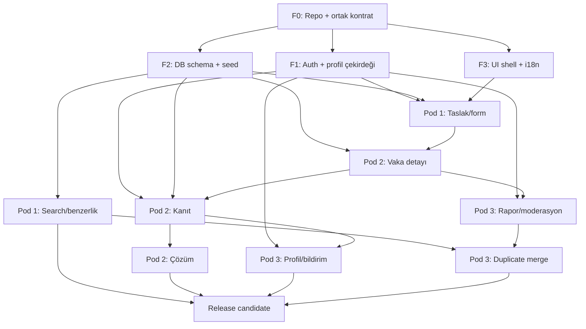

# 05 — 9 Kişilik Pod Planı ve Bağımlılıklar

## 1. Takım modeli

Proje 9 katılımcı için üç dikey poda ayrılır. Her pod yalnız ekran veya yalnız backend yapmaz; kendi kullanıcı akışının UI, doğrulama, server işlemi, test ve dokümantasyonunu birlikte teslim eder.

Bora onuncu üretim noktası değildir. Baş maintainer ve entegrasyon sorumlusudur:

- ortak mimari ve repo iskeleti;
- auth, DB, storage ve deployment güven sınırları;
- ortak kontratlar ve migration penceresi;
- podların ayrı toplantıları;
- çapraz review ve release kararı;
- zor tasklarda eşli canlı geliştirme.

## 2. Podları neye göre bölüyoruz?

Pod sınırı teknolojiye göre değil, kullanıcının tamamlayabildiği sonuca göre çizilir:

```text
Pod 1: Aradım ve geçerli bir vaka yayınladım.
Pod 2: Kaynaklı kanıt ekledim ve vakayı çözdüm.
Pod 3: Katkımı takip ettim; kötü içeriği bildirdim; sistem güvenle yönetti.
```

Bu ayrımın faydası:

- her podun demosu tek başına anlaşılır;
- bir taskta frontend–backend sahipliği kaybolmaz;
- dosya çakışması azalır;
- yeni başlayan kişi özelliğin tüm yolunu görür;
- release problemi çıktığında hangi podun akışı bozduğu bellidir.

## 3. Pod dağılımı

### Pod 1 — Keşif ve Vaka Açma

**Ürün sonucu:** Kullanıcı mevcut vakayı bulur veya benzer kontrolünden sonra yeni vaka yayınlar.

**3 kişi:**

| Koltuk | Başlangıç sorumluluğu | İsim |
|---|---|---|
| P1-A | Pod lead / entegrasyon bağlantısı | __________ |
| P1-B | Builder / UI akışı | __________ |
| P1-C | Verifier / search ve form testleri | __________ |

Koltuklar uzmanlık veya hiyerarşi değildir. Driver, reviewer ve verifier şapkaları tasktan taska döner.

**Sahip olduğu kullanıcı akışları:**

- ana sayfa araması;
- arama sonuçları, filtre, pagination;
- boş/hata/loading/success durumları;
- benzer vaka önerileri;
- yönlendirmeli, medya türüne göre değişen vaka formu;
- private taslak;
- publish ön kontrolü ve güvenlik onayı;
- public vaka listesine giriş.

**Sahip olduğu teknik alanlar:**

```text
features/discovery/
components/search/
components/case-create/
app/[locale]/(public)/search/
app/[locale]/(member)/cases/new/
server/domain/search/
server/domain/cases/create*
tests/**/discovery*
tests/**/case-create*
```

**Sahip olmadığı alanlar:** evidence durumları, çözüm, moderation action, auth provider config, migration merge'i, shared error envelope.

**Pod 1 demo cümlesi:** “Bu belirsiz hatırayı aradım, benzerini bulamadım, formu tamamlayıp public vaka yayınladım.”

### Pod 2 — Vaka Araştırması ve Çözüm

**Ürün sonucu:** Araştırmacı kaynaklı kanıt ekler; vaka sahibi kanıtı değerlendirir ve doğrulanmış çözüm oluşturur.

**3 kişi:**

| Koltuk | Başlangıç sorumluluğu | İsim |
|---|---|---|
| P2-A | Pod lead / domain kontratı | __________ |
| P2-B | Builder / vaka ve kanıt UI | __________ |
| P2-C | Verifier / durum makinesi testleri | __________ |

**Sahip olduğu kullanıcı akışları:**

- public vaka detay sayfası;
- kanıt kartı ekleme/düzenleme;
- kaynak URL ve gerekçe doğrulama;
- `Yeni/Olası/Elendi/Doğrulandı` durumları;
- vaka `Açık/Araştırılıyor/Güçlü aday/Çözüldü` akışı;
- çözüm özeti;
- elenen adayların görünürlüğü;
- evidence attachment'ı kullanma; upload çekirdeğini Bora sağlar.

**Sahip olduğu teknik alanlar:**

```text
features/case-workspace/
components/case-detail/
components/evidence/
app/[locale]/(public)/cases/[slug]/
server/domain/evidence/
server/domain/cases/status*
server/domain/cases/solve*
tests/**/evidence*
tests/**/case-status*
```

**Sahip olmadığı alanlar:** search ranking, vaka formu, report queue, auth/storage düşük seviye adaptörü, DB migration merge'i.

**Pod 2 demo cümlesi:** “Bu vakaya kaynak ve gerekçeyle aday ekledim, yanlış adayı eledim, doğru adayı doğrulayıp vakayı çözdüm.”

### Pod 3 — Güven, Profil ve Süreklilik

**Ürün sonucu:** Üye katkısını ve bildirimini takip eder; şüpheli içeriği bildirir; moderatör raporu audit kaydıyla sonuçlandırır.

**3 kişi:**

| Koltuk | Başlangıç sorumluluğu | İsim |
|---|---|---|
| P3-A | Pod lead / moderation akışı | __________ |
| P3-B | Builder / profil ve notification UI | __________ |
| P3-C | Verifier / abuse ve permission testleri | __________ |

**Sahip olduğu kullanıcı akışları:**

- public profil ve kişinin public katkıları;
- kendi taslak ve katkı görünümü;
- uygulama içi bildirim listesi/okundu durumu;
- içerik raporlama;
- moderasyon kuyruğu;
- redaksiyon, hide/restore ve soft delete;
- duplicate preview/merge UI;
- canonical redirect davranışının ürün tarafı.

**Sahip olduğu teknik alanlar:**

```text
features/trust/
components/profile/
components/moderation/
app/[locale]/(public)/profiles/[handle]/
app/[locale]/(member)/me/
app/[locale]/(member)/notifications/
app/[locale]/(moderator)/moderation/
server/domain/moderation/
server/domain/notifications/
tests/**/moderation*
tests/**/permissions*
```

**Sahip olmadığı alanlar:** auth protokolü, upload validation pipeline, search query, evidence domain transition kodu, migration merge'i.

**Pod 3 demo cümlesi:** “Kanıt eklenince bildirim aldım, kişisel veri riski taşıyan içeriği raporladım, moderatör redakte edip audit kaydı bıraktı.”

## 4. Bora'nın ortak çekirdek alanı

Bora tek başına tüm çekirdeği yazmak zorunda değildir; task sahibi bir pod üyesi olabilir. Fakat aşağıdaki değişikliklerin entegrasyon onayı Bora'dadır:

```text
server/auth/
server/db/
server/storage/
server/observability/
lib/schemas/shared*
lib/errors/
components/shared/
supabase/migrations/
Dockerfile
CI config
deployment config
```

Ortak çekirdek taskında:

- tek owner atanır;
- ilgili pod reviewer verir;
- Bora contract/security reviewer olur;
- iki ayrı pod aynı anda çekirdek dosyaya girmez.

## 5. Pod içi roller

Her taskta üç şapka vardır:

| Şapka | Ne yapar? | Ne yapmaz? |
|---|---|---|
| Driver/Owner | Agentı yönetir, diff'i okur, taskı teslim eder | Kendi PR'ını onaylayıp merge etmez |
| Navigator/Reviewer | Kapsam, kontrat, okunabilirlik ve risk kontrolü | Owner yerine kodu gizlice bitirmez |
| Verifier | Kabul kriterlerini çalışan üründe dener, kanıt ekler | “Kod doğru görünüyor” ile yetinmez |

Şapkalar her 1–2 taskta döner. Aynı kişi sürekli yalnız test veya yalnız konuşma yapmaz.

### Tek owner kuralı

Yanlış:

```text
SEARCH-04 — Ayşe + Can + Ece
```

Doğru:

```text
owner: Ayşe
reviewer: Can
verifier: Ece
```

Eşli çalışma yapılabilir; sonuçtan yine owner sorumludur.

## 6. Dosya sahipliği ve değişiklik protokolü

### Kendi alanında

Pod task açar, branch çıkarır, review ve verify yapar.

### Başka pod alanında

1. İhtiyacı taskta yazar.
2. Hedef pod lead'ini mention eder.
3. Ya hedef pod işi alır ya da geçici değişiklik yetkisi verir.
4. En az bir hedef pod reviewer olur.

### Ortak çekirdekte

1. Karar kaydı gerekir.
2. Etkilenen kontratlar listelenir.
3. Bora owner veya final reviewer atar.
4. Değişiklik küçük, backward-compatible PR olur.
5. Etkilenen pod testleri aynı PR veya bağlı PR'larda geçer.

## 7. Bağımlılık haritası



## 8. Paralel çalışma dalgaları

Takvim haftaya değil, geçilen kapıya göre ilerler.

### Dalga 0 — Foundation

**Bora + pod leadleri:** repo, conventions, CI, schema v1, auth stub değil gerçek test ortamı, UI shell, i18n, error envelope.

Pod üyeleri beklemez:

- Pod 1 arama/form view model ve fixture ile UI state kurar.
- Pod 2 vaka/kanıt kartı ve durum makinesi unit testini kurar.
- Pod 3 rapor/profil/notification view model ve permission matrisini kurar.

Fixture yalnız test ve Storybook/izole geliştirme içindir; production mock data değildir.

### Dalga 1 — İlk çalışan omurga

- Pod 1: taslak → publish → public vaka.
- Pod 2: public vaka detayı.
- Pod 3: public profil + kendi katkıları.

**Entegrasyon kapısı:** Giriş yapan kullanıcı vaka yayınlar, dışarıdan public sayfa açılır.

### Dalga 2 — Araştırma döngüsü

- Pod 1: search + filtre + similar check.
- Pod 2: evidence create + status transitions.
- Pod 3: notification + report create.

**Entegrasyon kapısı:** Arama sonrası vaka bulunur/açılır; ikinci kullanıcı kanıt ekler; vaka sahibi bildirim alır ve kanıtı değerlendirir.

### Dalga 3 — Güven ve çözüm

- Pod 1: search ranking ve empty/error polish.
- Pod 2: strong candidate + solve/reopen.
- Pod 3: moderation queue + merge + redaction.

**Entegrasyon kapısı:** Gerçek vaka güvenli biçimde çözülür; duplicate ve rapor davranışı çalışır.

### Dalga 4 — Release hardening

Tüm podlar: E2E, a11y, perf, security, docs, Docker, backup/restore, clean install, pilot veri.

Yeni özellik yok. Yalnız bug, kırık UX, güvenlik, performans ve release dokümanı.

## 9. Pod toplantıları — B modeli

Her pod Bora ile ayrı gün/saat görüşür. Toplantı lecture değil, çalışan ürün ve karar oturumudur. Varsayılan süre 60–90 dakika.

### Toplantıdan 24 saat önce podun hazırlayacağı

- çalışan branch/PR linkleri;
- pano durumu;
- bir ana demo akışı;
- en fazla üç blokaj;
- contract değişikliği talebi;
- doğrulama komutları ve son exit code;
- karar gerektiren tek cümlelik sorular.

### Toplantı akışı

| Süre | İçerik | Çıktı |
|---:|---|---|
| 0–10 dk | Geçen kararlar ve pano | Güncel hedef |
| 10–25 dk | Ekran paylaşımıyla çalışan demo | Gerçek durum |
| 25–45 dk | Bir sorun üzerinde canlı agent kullanımı | Küçük doğrulanmış ilerleme |
| 45–60 dk | Diff/review/test | Kabul veya açık hata |
| 60–75 dk | Sonraki taskların bölünmesi | Owner/reviewer/verifier |
| 75–90 dk | Contract ve diğer pod handoff'u | Karar kaydı + bağımlılık |

Toplantı 60 dakikaysa son iki bölüm birleştirilir. Demo yoksa ilk amaç neden çalışmadığını yeniden üretmektir; sözlü durum raporu toplantıyı tüketmez.

### Pod sırası

Sabit gün seçimi ekip uygunluğuna göre yapılır. Bağımlılık gereği aynı turda önerilen sıra:

1. Pod 1 — yeni veri/arama kontratı etkileri
2. Pod 2 — evidence/solution entegrasyonu
3. Pod 3 — güven ve downstream akışlar
4. Bora — ortak entegrasyon/release penceresi

## 10. Podlar arası handoff

Bir pod “bitti” demez, tüketici podun kullanabileceği kontrat bırakır:

```text
üreten pod
→ kontrat ve örnek response
→ unit/integration testi
→ tüketici pod review'i
→ preview ortamı
→ handoff kaydı
```

Handoff içeriği:

- ne değişti;
- public contract;
- migration/env etkisi;
- nasıl denenir;
- bilinen sınır;
- rollback/disable yolu;
- tüketici podun yapacağı net sonraki task.

## 11. Task boyutu

- `S`: 2–4 saatlik odak; tek küçük davranış.
- `M`: en çok 1 iş günü; tek kullanıcı sonucu.
- `L` yok. İki veya daha fazla domain davranışı varsa bölünür.

Task “arama yap” değil:

```text
SEARCH-04 — Medya türü filtresini arama kontratına bağla
owner: P1-B
reviewer: P1-A
verifier: P1-C
depends_on: CORE-07
blocks: TRUST-12
acceptance:
- seçili tür query'ye eklenir
- URL state geri/ileri navigasyonda korunur
- boş sonuç CTA gösterir
- invalid tür 400 döner
- unit + E2E filtre senaryosu geçer
```

## 12. Branch, PR ve merge

```text
feat/SEARCH-04-media-filter
fix/EVID-09-transition-conflict
docs/CORE-03-contract-decision
```

- Bir branch mümkünse bir task.
- PR hedefi küçük; code review 20–30 dakikada anlaşılabilir.
- PR başlığı task ID taşır.
- Owner DCO sign-off kullanır: `git commit -s`.
- Kendi PR'ını merge etmez.
- Pod reviewer + CI gerekir.
- Şema, auth, upload, CORS, raw SQL veya security boundary değişikliğinde Bora onayı gerekir.

## 13. Blokaj protokolü

```text
20 dk: Pod içinde sor.
40 dk: Minimal reproduction + hata metniyle yardım kanalına aç.
Pod toplantısına kadar: Blokaj kaydı ve denenenler hazır olsun.
Release blocker: Aynı gün Bora'ya yükselt.
```

“Çalışmadı” blokaj değildir. Şunlar yazılır:

- beklenen;
- gerçekleşen;
- exact hata;
- yeniden üretme adımları;
- denenenler;
- en küçük soru.

## 14. Kişi yokluğu ve hız farkı

- Task owner 24 saatten uzun yoksa pod lead yeniden atama önerir.
- PR içindeki yarım iş zorla merge edilmez; branch korunur, handoff yazılır.
- Hızlı kişi başka podun çekirdek dosyasını habersiz almaz; `help-wanted` task seçer.
- Eşli çalışma katkı sayılır; commit ve PR açıklamasında belirtilir.
- Haftalık taban: kişi başı en az bir doğrulanmış katkı. Kod, test, doküman, accessibility veya araştırma olabilir.

## 15. Pod sağlığı ölçümü

Hız tek ölçüt değildir. Her tur şu beş sinyal izlenir:

| Sinyal | Sağlıklı durum |
|---|---|
| Akış | En az bir kullanıcı davranışı demo ediliyor |
| Boyut | Açık taskların çoğu S/M |
| Review | PR'lar 24–48 saat içinde inceleniyor |
| Doğrulama | “Bitti” kartlarının kanıtı var |
| Öğrenme | Roller dönüyor; bilgi tek kişide kalmıyor |

## 16. Pod Definition of Done

Bir pod dilimi şu şartlarda entegrasyona hazırdır:

- kullanıcı sonucu preview'da gösterildi;
- loading/empty/error/success durumları var;
- auth/ownership negatif senaryosu test edildi;
- API ve veri kontratı güncel;
- unit/integration ve ilgili E2E geçti;
- keyboard ve temel screen-reader kontrolü yapıldı;
- loglarda PII/secret yok;
- reviewer onayı ve verifier kanıtı var;
- başka podun downstream smoke testi geçti;
- bilinen sınırlar handoff'a yazıldı.
