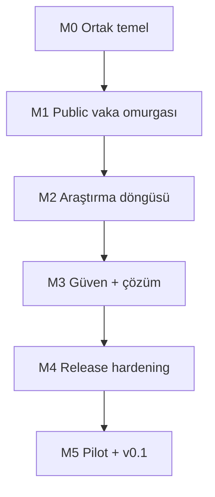

# 08 — Uygulama Planı ve Task DAG

## 1. Kullanım

Bu belge sabit workshop takvimi değildir. İşler bağımlılık ve release kapısına göre alınır. Her kart repo issue'suna çevrilirken gerçek isim, dosya yolu, komut ve mevcut kod referansı eklenir.

Koltuk kodları:

- `P1-A/B/C`: Keşif ve Vaka Açma
- `P2-A/B/C`: Vaka Araştırması ve Çözüm
- `P3-A/B/C`: Güven, Profil ve Süreklilik
- `BORA`: Baş maintainer/entegrasyon

Task owner tek kişidir. Reviewer ve verifier issue açılırken farklı kişilere atanır.

## 2. Büyük bağımlılık zinciri



## 3. M0 — Ortak temel

### Gate

Temiz kurulum çalışan app açılır; test DB bağlantısı ve gerçek auth test ortamı vardır; UI shell TR/EN çalışır; CI typecheck/test/build yürütür. Production deploy yapılmaz.

| ID | Owner | Task | Depends on | Blocks |
|---|---|---|---|---|
| CORE-01 | BORA | Repo iskeleti, conventions, strict TS, formatter/lint | — | Tümü |
| CORE-02 | P1-B | Ortak error envelope ve request ID kontratı | CORE-01 | Tüm API |
| CORE-03 | P3-B | TR/EN i18n shell ve system status sözlüğü | CORE-01 | Tüm UI |
| CORE-04 | BORA | Schema v1 migration + typed DB adapter | CORE-01 | Vaka/kanıt/trust |
| CORE-05 | P3-B | Google + e-posta OTP UI/domain adapter | CORE-01 | Auth akışları |
| CORE-06 | BORA | Session, role, ownership helper + RLS test harness | CORE-04, CORE-05 | Tüm mutasyon |
| CORE-07 | P2-B | Ortak case/evidence runtime schema ve view model | CORE-01, CORE-04 | Pod 1/2 |
| CORE-08 | BORA | Storage intent/finalize güvenli çekirdek | CORE-02, CORE-04, CORE-06 | EVID-06 |
| CORE-09 | P2-C | Structured log + redaction + error adapter | CORE-02 | Release |
| CORE-10 | BORA | Docker standalone + health + CI başlangıcı | CORE-01 | Preview/release |
| CORE-11 | P1-C | Sentetik seed + test fixture standardı | CORE-04, CORE-07 | Search/E2E |
| CORE-12 | P3-C | Permission matrisini executable test tablosuna çevir | CORE-06, CORE-07 | Security gate |

### CORE kabul kriterleri

- `CORE-01`: fresh install, lint, typecheck ve placeholder olmayan minimal app.
- `CORE-02`: stabil error codes; stack/provider detayı response'a sızmaz.
- `CORE-03`: locale switch route'u korur; eksik key CI'da yakalanır.
- `CORE-04`: temiz DB migration; enum/constraint testleri; rollback notu.
- `CORE-05`: Google ve OTP success/error/rate-limit UI; hesap enumeration yok.
- `CORE-06`: member/moderator/owner negatif testleri; service role client'a girmez.
- `CORE-07`: DB/transport/UI aynı enumları kullanır; unknown input reddedilir.
- `CORE-08`: sahte MIME, büyük dosya ve başka user intent'i reddedilir; EXIF temizlenir.
- `CORE-09`: request ID ve süre var; e-posta/token/search text yok.
- `CORE-10`: non-root container; liveness/readiness; CI exit 0.
- `CORE-11`: production kişisel verisi yok; deterministik seed.
- `CORE-12`: her yetki satırı için allow + deny testi.

## 4. M1 — Public vaka omurgası

### Gate

Üye taslak oluşturur ve vaka yayınlar; çıkış yapmış ziyaretçi public sayfayı okur; profil yalnız public bilgiyi gösterir.

| ID | Owner | Task | Depends on | Blocks |
|---|---|---|---|---|
| CASE-01 | P1-B | Medya türü seçimi + yönlendirmeli form shell | CORE-03, CORE-07 | CASE-02 |
| CASE-02 | P1-A | Draft create/update service + optimistic conflict | CORE-02, CORE-06, CORE-07 | CASE-03 |
| CASE-03 | P1-C | Form validation, error summary ve draft autosave UI | CASE-01, CASE-02 | CASE-05 |
| CASE-04 | P1-B | Similar-check token kontratı, başlangıç query'si | CORE-04, CORE-11 | CASE-05, SEARCH-04 |
| CASE-05 | P1-B | Publish transaction + safety confirmation | CASE-03, CASE-04 | CASE-06 |
| CASE-06 | P2-A | Public case query/view model | CASE-05 | CASE-07, EVID-01 |
| CASE-07 | P2-B | Public case detail loading/error/merged states | CORE-03, CASE-06 | EVID-01 |
| PROF-01 | P3-B | Public profile view + katkı listesi | CORE-03, CORE-06, CASE-05 | PROF-02 |
| PROF-02 | P3-A | Kendi taslakları/private profile view | PROF-01, CORE-12 | Release |

### Ana acceptance

- Form refresh/yeniden login sonrası mümkün olan girdiyi korur.
- Draft başka üye tarafından okunamaz.
- Publish zorunlu alanları server'da da doğrular.
- Similar check görülmeden publish olmaz; kullanıcı yine de “devam et” seçebilir.
- Public URL auth'suz açılır; draft aynı URL'de `404`.
- UI loading/empty/error/success durumlarını gösterir.
- Profil e-posta veya auth sağlayıcısını göstermez.

## 5. M2 — Arama ve araştırma döngüsü

### Gate

Ziyaretçi vakayı arar; ikinci üye kaynaklı kanıt ekler; vaka sahibi kanıtı değerlendirir ve uygulama içi bildirim alır.

| ID | Owner | Task | Depends on | Blocks |
|---|---|---|---|---|
| SEARCH-01 | P1-A | FTS search_document + GIN migration isteği/uygulaması | CORE-04, CORE-11 | SEARCH-03 |
| SEARCH-02 | P1-C | Trigram normalize ve benzerlik unit test seti | CORE-11 | SEARCH-03 |
| SEARCH-03 | P1-A | Search repository: FTS + trigram + deterministic rank | SEARCH-01, SEARCH-02 | SEARCH-04 |
| SEARCH-04 | P1-B | Search route + filtre + cursor contract | SEARCH-03, CORE-02 | SEARCH-05, DUP-01 |
| SEARCH-05 | P1-C | Search UI: URL state, empty/error/loading, match signals | SEARCH-04, CORE-03 | Release |
| EVID-01 | P2-B | Evidence card display + status badges | CASE-07, CORE-07 | EVID-02 |
| EVID-02 | P2-A | Evidence create service + URL/rationale validation | EVID-01, CORE-06 | EVID-03, NOTIF-01 |
| EVID-03 | P2-C | Evidence create form + idempotent submit UX | EVID-02, CORE-03 | EVID-04 |
| EVID-04 | P2-A | Evidence transition state machine + event transaction | EVID-02, CORE-12 | EVID-05 |
| EVID-05 | P2-C | Owner moderation controls + negative transition tests | EVID-04 | SOLVE-01 |
| EVID-06 | P2-B | Güvenli attachment'ı evidence formuna bağla | CORE-08, EVID-03 | Release |
| NOTIF-01 | P3-A | Notification create/read repository + idempotency | EVID-02, CORE-04 | NOTIF-02 |
| NOTIF-02 | P3-B | Notification list/unread UI | NOTIF-01, CORE-03 | Release |
| REPORT-01 | P3-C | Report create schema/service + duplicate/rate limit | CASE-06, EVID-01, CORE-12 | MOD-01 |
| REPORT-02 | P3-B | Case/evidence report UI + success/error states | REPORT-01 | MOD-01 |

### Ana acceptance

- Arama 2–200 karakter; filtreler URL'de; cursor tekrar üretilebilir.
- Search input SQL'e birleştirilmez.
- Kanıt için claim, HTTP(S) source ve rationale zorunlu.
- Server source URL'yi fetch etmez.
- Aynı idempotency key duplicate kart üretmez.
- Evidence eklenince `OPEN→RESEARCHING` atomik olur.
- Owner olmayan member evidence status değiştiremez.
- Elenen kanıt gerekçesiyle görünmeye devam eder.
- Notification serbest evidence metnini payload'a kopyalamaz.
- Report başka hedef için kullanılamaz; PII reason yüksek priority olur.

## 6. M3 — Çözüm, moderasyon ve duplicate

### Gate

Vaka güçlü adaydan çözüme gider; rapor audit kaydıyla ele alınır; duplicate vaka veri kaybı olmadan canonical vakaya birleşir.

| ID | Owner | Task | Depends on | Blocks |
|---|---|---|---|---|
| SOLVE-01 | P2-A | Strong candidate transition ve izinler | EVID-05 | SOLVE-02 |
| SOLVE-02 | P2-B | Solve form + solution transaction | SOLVE-01 | SOLVE-03 |
| SOLVE-03 | P2-C | Public solution summary + reopen testleri | SOLVE-02, NOTIF-01 | Release |
| MOD-01 | P3-A | Moderation queue query/permission | REPORT-01, CORE-12 | MOD-02 |
| MOD-02 | P3-B | Queue UI: priority/filter/assignment | MOD-01 | MOD-03 |
| MOD-03 | P3-A | Redact/hide/restore/soft-delete action services | MOD-01, CORE-09 | MOD-04 |
| MOD-04 | P3-C | Audit history view + PII cache purge E2E | MOD-02, MOD-03 | Release |
| DUP-01 | P3-A | Duplicate relation + cycle/canonical kuralları | SEARCH-04, CORE-04 | DUP-02 |
| DUP-02 | P3-B | Merge preview UI + impact summary | DUP-01, CASE-07 | DUP-03 |
| DUP-03 | P3-C | Merge transaction + 308 + rollback test | DUP-02, MOD-03 | Release |
| SAFE-01 | P1-C | Publish PII/doxxing uyarı ve redaction UX | CASE-05, REPORT-01 | Release |
| SAFE-02 | P2-C | External link safe-render ve XSS testleri | EVID-01 | Release |

### Ana acceptance

- Solve aynı transactionda solution/event/case/notification üretir.
- Çözümün source + explanation'ı vardır; link tek başına çözüm değildir.
- Moderator reopen reason ve audit olmadan çalışmaz.
- Moderation action allowlist dışı patch kabul etmez.
- PII redaksiyonu public cache'ten eski metni kaldırır.
- Merge preview ile apply arasında değişiklik varsa conflict döner.
- Merge cycle oluşmaz; source katkıları ve origin bilgisi korunur.
- Eski URL `308`; search yalnız canonical sonucu gösterir.

## 7. M4 — Release hardening

### Gate

Kod feature-freeze altındadır. Ana E2E, security, a11y, perf, container, restore ve clean install kanıtları geçer.

| ID | Owner | Task | Depends on | Blocks |
|---|---|---|---|---|
| QA-01 | P1-C | Search + case creation full E2E | M1, SEARCH-05 | RC |
| QA-02 | P2-C | Evidence + solve full E2E | SOLVE-03 | RC |
| QA-03 | P3-C | Report + moderation + merge full E2E | MOD-04, DUP-03 | RC |
| A11Y-01 | P1-B | Search/form keyboard + axe + zoom | QA-01 | RC |
| A11Y-02 | P2-B | Case/evidence/solve keyboard + SR smoke | QA-02 | RC |
| A11Y-03 | P3-B | Profile/moderation/dialog a11y | QA-03 | RC |
| PERF-01 | P1-A | 10k case search benchmark + query plans | SEARCH-05 | RC |
| SEC-01 | P3-A | IDOR/RLS/auth negative suite | CORE-12, M3 | RC |
| SEC-02 | P2-A | Upload/URL/XSS security suite | EVID-06, SAFE-02 | RC |
| OPS-01 | BORA | Preview deploy, env validation, health smoke | CORE-10, M3 | RC |
| OPS-02 | BORA | Migration + backup/restore + rollback rehearsal | OPS-01 | RC |
| OSS-01 | P3-C | README/LICENSE/CONTRIBUTING/DCO/SECURITY | CORE-10 | RC |
| SEO-01 | P1-B | Meta/canonical/sitemap/robots/noindex | CASE-07, DUP-03 | RC |
| OBS-01 | P2-B | Error monitoring handshake + redaction test | CORE-09, OPS-01 | RC |
| RC-01 | BORA | Cross-pod release-candidate checklist | Tüm M4 | Pilot |

## 8. M5 — Pilot ve v0.1

### Gate

En az bir rızalı gerçek vaka uçtan uca test edilir. Teknik release kriterleri geçerse v0.1 çıkar. Gerçek vakanın çözülmesi ayrı deney sonucu olarak izlenir.

| ID | Owner | Task | Depends on |
|---|---|---|---|
| PILOT-01 | P1-A | Gerçek kullanıcıyla arama ve case-create gözlemi | RC-01 |
| PILOT-02 | P2-A | Kaynaklı evidence kalite kontrolü | PILOT-01 |
| PILOT-03 | P3-A | Report/moderation operasyon provası | PILOT-01 |
| FIX-01 | BORA | Pilot P0/P1 triage ve feature-freeze kararı | PILOT-01..03 |
| REL-01 | P1-C | Release notes + known limitations | FIX-01 |
| REL-02 | P2-C | Demo doğrulama senaryosu ve evidence | FIX-01 |
| REL-03 | P3-C | Open-source/community checklist | FIX-01 |
| REL-04 | BORA | v0.1 tag/release kararı | REL-01..03 |

## 9. Task “Hazır” tanımı

Bir kart ancak şunlar varsa alınır:

- tek kullanıcı sonucu;
- owner, reviewer, verifier;
- gerçek dosya/klasör sınırı;
- `depends_on` ve `blocks`;
- ölçülebilir acceptance criteria;
- auth/PII/security etkisi;
- normal + en az bir hata senaryosu;
- doğrulama komutu;
- beklenen çıktı/kanıt;
- S veya M boyutu.

## 10. Task “Bitti” tanımı

- acceptance kriteri tek tek kanıtlandı;
- ilgili testler, typecheck, lint ve build geçti;
- reviewer onayı var;
- verifier preview'da denedi;
- loading/empty/error/success durumları tamam;
- auth/permission negatif yolu test edildi;
- docs/contract/migration etkisi güncel;
- DCO sign-off var;
- main ile conflict yok;
- bilinen risk PR'da yazılı.

## 11. Kritik yol

Release'i en çok geciktirebilecek zincir:

```text
CORE-04 schema
→ CORE-06 auth/permission
→ CASE-05 publish
→ CASE-06 public case
→ EVID-02 evidence create
→ EVID-04 transitions
→ SOLVE-02 solution
→ MOD/DUP güven akışları
→ QA/SEC/OPS
→ RC-01
```

Bora ayrı pod toplantılarında önce kritik yol blockerlarını ele alır. Kritik yol dışındaki polish, bu zincirin önüne geçmez.

## 12. Kapsam kesme sırası

Süre baskısında güvenlik veya kanıt modeli kesilmez. Şu sıra uygulanır:

1. P1/P2 backlog'u çıkar.
2. Profil görselliğini sadeleştir.
3. Notification tiplerini azalt; çözüm/evidence çekirdeğini koru.
4. Moderation UI filtrelerini azalt; action/audit'i koru.
5. Medya türüne özel opsiyonel alan sayısını azalt; ortak zorunlu alanları koru.

Kesilmeyecekler:

- auth/ownership;
- evidence source + rationale;
- elendi/olası/doğrulandı ayrımı;
- solve bütünlüğü;
- PII rapor/redaksiyon;
- upload validation;
- test/build/release kanıtı;
- açık kaynak lisans ve DCO.
